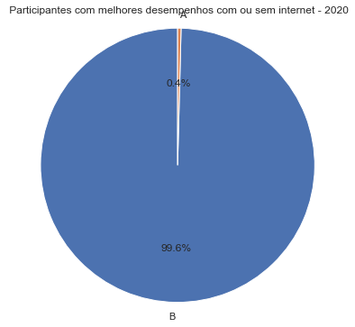

# Análise e visualizações
##### Beatriz Lúcia Teixeira de Souza

Este arquivo contém de forma detalhada os resultados da minha analise dos dados do ENEM 2022. Este, estará organizado da seguinte forma: 

- análise feita
- visualização 
- conclusões

## Rendimento do Brasil antes e depois da pandemia

Sabemos que a pandemia da covid-19 impactou a vida de todos nós. Por isso, queríamos analisar como que a pandemia afetou as notas dos alunos no ENEM. A análise, apesar de conter os ano 2019 (antes da pandemia), 2020, 2021, 2022 (anos de pandemia)

- #### Média das notas e renda do Brasil durante os anos 

Neste gráfico podemos perceber que houveram variações significativas ba rebda por participantes, provavelmente devido a ajustes salariais. Já a média das notas nos anos não tiveram grandes alterações. Isto devido a distribuição das notas que segue a distribuição normal.
- ##### Média das notas no ENEM por ano

Sem muitas mudanças na média

- #### distribuição normal das notas por ano 
#### 2019

#### 2020

#### 2021

#### 2022

A curva de 2019 e 2022 não possui inclinações tão fortes para a esquerda quando dos anos de 2020 e 2021 (é coincidência que estes foram os anos em que os efeitos da pandemia foram mais acentuados? Com certeza não).
 Ao calcularmos os desvio padrão das notas, obtemos um deslocamento das curvas de 2020 e 2021, anos de pico da pandemia, para a esquerda (mais pessoas tiveram notas menores), confirmando assim, a premissa de que a Covid-19 piorou o rendimento dos alunos. 
#

- #### proporção dos participantes que tem acesso à internet 
A - sem acesso à internet
B - com acesso à internet

- Naturalmente, o acesso à internet é facilitado dos dias atuais, e por isso o aumento da incidência
#

 #### proporção dos participantes com as maiores notas que tem acesso à internet 
A - sem acesso à internet
B - com acesso à internet

- a maior parte das pessoas com as maiores notas tiveram acesso à internet. 

#

 #### proporção dos participantes com as menores notas que tem acesso à internet 
A - sem acesso à internet
B - com acesso à internet

- Uma parte considerável dos estudantes com as piores notas não tiveram acesso à internet

# 

 #### Participantes com as maiores notas que tem acesso à internet pelos estados

# 

#

Os estados com as mais alunos entre os melhores em todos od anos foi São Paulo e Minas Gerais

#### Participantes com as menores notas que tem acesso à internet pelos estados

piores: São Paulo, Ceará
# 

piores: São Paulo, Ceará

#

piores: Paraná, Pernambuco

piores: São Paulo, Ceará

