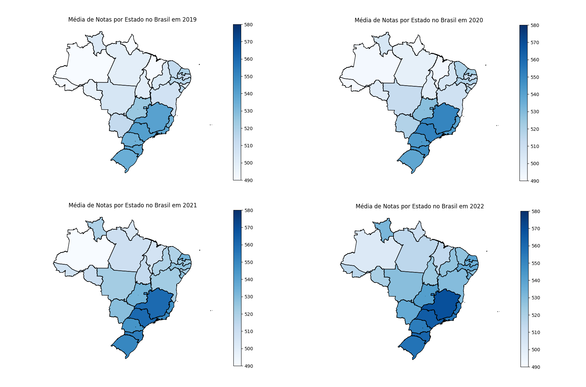
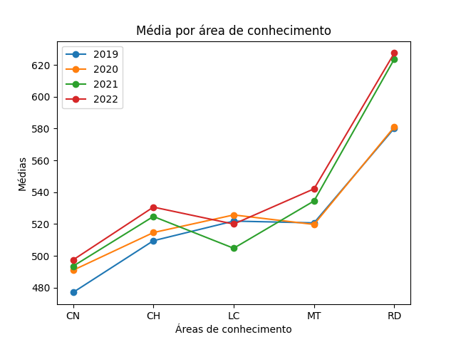
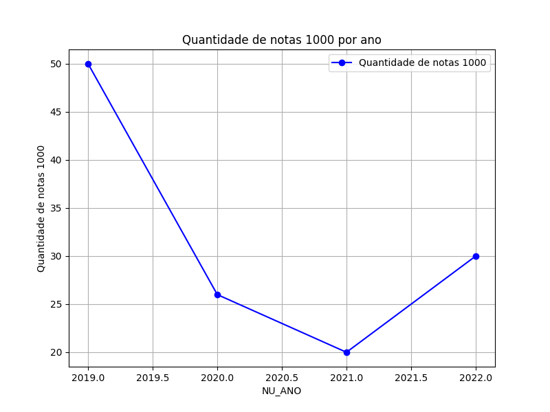
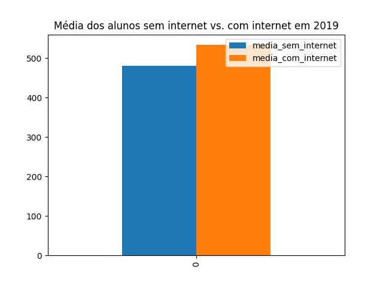
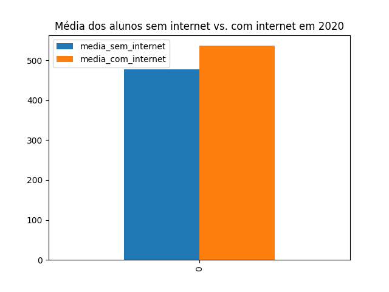
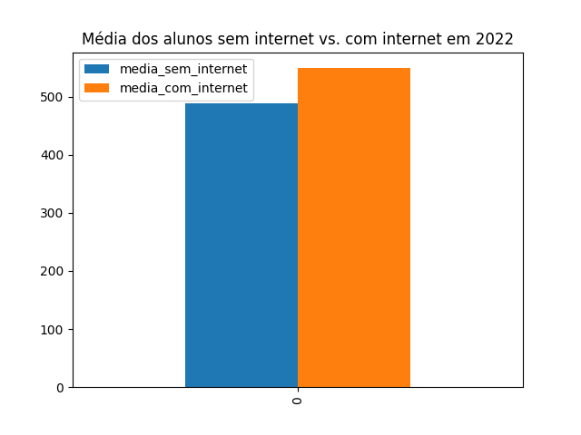

# Análise do desempenho dos participantes do ENEM durante a Pandemia da Covid-19
<h4 align="right">Por Roberta Müller Nuñes</h4>

## Perguntas para a Hipótese 

I) Como a pandemia influenciou no devenvolvimento dos participantes do ENEM?

II) A situação financeira dos participantes do ENEM foi um fator importante para o rendimento deles?

III) O acesso a recursos tecnológicos contribuiu para um melhor rendimento?

## Hipótese

As perguntas para a criação da hipótese sugerem que o desempenho dos participantes do Exame Nacional do Ensino Médio (ENEM) em avaliações realizadas antes da eclosão da pandemia da Covid-19 é superior ao desempenho nas avaliações subsequentes. Ainda, existe a suposição de que a situação financeira dos candidatos exerceu um papel decisivo na determinação de suas pontuações, indicando que à medida que a renda aumentava, as notas tendiam a ser mais elevadas. Além disso, considerando que o ensino à distância se tornou predominante durante a pandemia, notadamente nos anos de 2020 e 2021, é plausível sugerir que participantes que não dispunham de acesso à internet possam ter apresentado um desempenho inferior em comparação com aqueles que tinham facilidade de acesso a dispositivos móveis e à internet.

Portanto, a hipótese inicial sustentada é a seguinte:

<h4 style="text-align: justify;">A pandemia da Covid-19 exerceu influência significativa sobre o desempenho dos candidatos no ENEM. Somado a issso, nesse período, verificou-se uma correlação entre a renda dos participantes e o acesso à internet, com uma tendência de que à medida que a renda diminui e o acesso à internet se torna mais restrito, o desempenho dos candidatos também diminui.</h4>

## Análise

Inicialmente, cabe reafirmar a hipótese a ser testada a partir da limpeza e observação dos dados disponibilizados pelo Instituto Nacional de Estudos e Pesquisas Educacionais Anísio Teixeira (INEP), a respeito do desempenho dos participantes do Exame Nacional do Ensino Médio (ENEM) nos anos de 2019, 2020, 2021 e 2022. Assim, sabe-se que a hipótese levantada pelo grupo contém 3 pontos principais a serem avaliados:
 

1. A pandemia da Covid-19 influenciou o desempenho dos participantes.
2. Quanto menor a renda, pior o desempenho no exame.
3. Menos acesso à internet implica menores notas no período afetado pela pandemia da Covid-19.

Desta maneira, é necessária a avaliação dos resultados obtidos por meio da utilização das funções criadas para análise e visualizações (presentes em [analise.py](https://github.com/Pavanato/PandENEM/blob/modulo_analise/modulo_analise/analise.py) e [visual_rob.py](https://github.com/Pavanato/PandENEM/blob/visual_rob/visual_rob/visual_rob.py), respectivamente).

 Assim, inicia-se, de fato, a análise com a avaliação do primeiro ponto principal da análise. Assim, serão analisadas as médias de notas por estado, a média de notas por área do conhecimento e o número de redações nota mil, de acordo com os quatro anos de ENEM da amostra.

<h5 style="text-align: center;">Figura 1: Mapas de média de notas por Estado</h5>

Analisando a figura 1, nota-se que as regiões sul e sudeste do Brasil têm as maiores médias no exame quando comparadas com as demais regiões do país. Além disso, observa-se que houve aumento na média geral estudual na maioria das unidades federativas, o que vai contra a primeira proposta da hipótese, pois o resultado esperado seria o de que as médias gerais tivessem decaído notavelmente, ao menos nos anos de 2020 e 2021 - o que não é o caso.

<h5 style="text-align: center;">Figura 2: Gráfico de média de notas por área de conhecimento</h5>

Neste contexto, é clara uma evolução consistente nas médias das áreas de Ciências da Natureza e suas Tecnologias (CN), Ciências Humanas e suas Tecnologias e Redação ao longo do período de avaliação de quatro anos. No entanto, constata-se uma diminuição nas médias das áreas de Linguagens, Códigos e suas Tecnologias (LC) e Matemática e suas Tecnologias (MT). É digno de nota que a redução nas médias de Linguagens contraria as expectativas, uma vez que o ano de 2021 apresentou a menor média, seguido por 2022, 2019 e, surpreendentemente, 2020. Isso implica que o primeiro ano da pandemia testemunhou a maior média na área de Linguagens nos últimos quatro anos do Exame Nacional do Ensino Médio (ENEM). Em relação à Matemática, observamos que houve uma ínfima diminuição na média em 2020, em comparação com 2019, o que está de acordo com a hipótese original. Consequentemente, em sua maioria de dados representados, o gráfico não valida a hipótese inicial.

<h5 style="text-align: center;">Figura 3: Gráfico de quantidade de notas mil na redação do ENEM</h5>

A partir da observação do gráfico acima, nota-se que a hipótese inicial foi satisfeita, uma vez que a quantidade de notas máximas na redação do ENEM decaiu drasticamente com a chegada da pandemia em 2020 e a queda persistiu em 2021. Já em 2022, quando as aulas voltaram ao modelo presencial de 2019, visualiza-se a reestruturação de mais notas 1000 na redação do ENEM.

Após essa análise acerca do primeiro aspecto da hipótese, cabe avaliar a segunda perspectiva colocada, "Quanto menor a renda, pior o desempenho". Para tanto, serão utilizados gráficos de dispersão, relacionando a média de notas dos participantes e suas rendas médias per capita.

  

    
  

  

    
  

  

    
  

  

    
  

<h5 style="text-align: center;">Figura 4: Gráficos de Dispersão Média vs. Renda</h5>

A função para o cálculo da média per capita de cada participante utilizada na construção dos gráficos acima não consegue ter uma precisão perfeita sobre essa renda, uma vez que as informações obtidas por meio do questionário socioeconômico do ENEM medem apenas a margem de renda per capita na qual o indivíduo está sujeito e não o valor exato.

Mesmo tendo em vista essas imprecisões, os dados obtidos ainda podem ser utilizados. Desta forma, tem-se que os gráficos de dispersão ao longo dos 4 anos seguiram um padrão definido, com poucas alterações. Desse modo, é notório que as pessoas com maior renda garantem, normalmente, média acima de 400, assim como as pessoas com renda per capita superior a 15000 reais. No entanto, a partir de apenas os gráficos, não é possível fazer uma análise que desbanque ou afirme o segundo ponto principal da hipótese, só haveria a possibilidade de afirmar que:

 

**Quanto maior a renda, menores são as chances de obter uma média das notas inferiores a 400**

Na tentativa de buscar resultados fieis à realidade, haveria a necessidade de, por exemplo, fazer uma regressão linear em cima dos resultados na tentativa de concluir alguma coisa. Porém, como o propósito do trabalho não se encaixa exatamente nesta necessidade, as conclusão serão tomadas sem a utilização dessas ferramentas matemáticas.

Por fim, cabe a análise do último aspecto da hipótese.

**3. Menos acesso à internet implica menores notas no período afetado pela pandemia da Covid-19.**

Para tal propósito, há a utilização de gráficos de barra e tabelas.

  

    
  

  

    
  

  

    
  

  

    
  

>
<h5 style="text-align: center;">Figura 5: Gráficos de Barra acerca da média de alunos com vs. sem internet</h5>

Aqui, nota-se que a média de notas de alunos sem internet é mantida, ao longo dos anos, sempre abaixo da média de notas dos alunos com acesso à internet.

<table>
  <thead>
    <tr>
      <th colspan="1">Ano</th>
      <th colspan="1">Média sem internet</th>
      <th colspan="1">Média com internet</th>
    </tr>
  </thead>
  <tbody>
    <tr>
      <td>2019</td>
      <td>481.365332</td>
      <td>533.417849</td>
    </tr>
    <tr>
      <td>2020</td>
      <td>477.028893</td>
      <td>536.44849</td>
    </tr>
    <tr>
      <td>2021</td>
      <td>479.045544</td>
      <td>542.062949</td>
    </tr>
    <tr>
      <td>2022</td>
      <td>487.588023</td>
      <td>548.833496</td>
    </tr>
  </tbody>
</table>

Com a tabela, é possível identificar que a média dos participantes sem internet decaiu com a chegada da pandemia, em 2020, voltando a subir posteriormente. Enquanto isso, a média das notas dos participantes com internet vem subindo nos últimos 4 anos, sem sofrer decréscimos. Ou seja, essa informação obtida corrabora a hipótese inicial.

## Conclusão da Análise Estatística

A presente análise teve como objetivo examinar a hipótese de que a pandemia da Covid-19 exerceu uma influência substancial sobre o desempenho dos candidatos no Exame Nacional do Ensino Médio (ENEM). Além disso, foi considerada a possibilidade de uma correlação entre a renda dos participantes e o acesso à internet, com a suposição de que, à medida que a renda diminui e o acesso à internet se torna mais restrito, o desempenho dos candidatos também diminui.

Com base nos resultados desta análise, conclui-se que a hipótese inicial não foi confirmada. Ao contrário das expectativas, observou-se que as médias de notas dos candidatos, de fato, aumentaram durante o período da pandemia. Esses resultados sugerem que os candidatos se adaptaram às circunstâncias desafiadoras da pandemia de uma maneira que não resultou em um declínio no seu desempenho no ENEM.

Por outro lado, a análise evidenciou uma correlação entre a renda dos participantes e o acesso à internet, indicando que à medida que a renda diminui e o acesso à internet se torna mais restrito, as médias de notas tendem a diminuir. Contudo, é importante destacar que essa descoberta não está diretamente relacionada à pandemia, uma vez que a influência da renda e do acesso à internet parece ser uma constante ao longo do período analisado.

Além disso, um aspecto interessante para visualizar os efeitos da pandemia da Covid-19 na tomada de decisões dos indivíduos é dado a partir da observação da tabela logo abaixo. Nela, tem-se que os números de inscritos e de presentes do último ENEM (2022) tiveram uma diminuição considerável em relação ao ano anterior à Pandemia. Fora isso, percebe-se que o ano de prova com a maior ausência dos inscritos é aquele em que a Pandemia começou (2020). Ou seja, análises que levam em conta a tomada de decisões humanas são bem-vindas ao tema e necessárias para total compreendimento da problemática, porém não cabem, por hora, ao projeto proposto em uma matéria de Linguagens de Programação.

<table>
  <thead>
    <tr>
      <th colspan="1">Ano</th>
      <th colspan="1">Inscritos</th>
      <th colspan="1">Presentes</th>
      <th colspan="1">Ausentes</th>
    </tr>
  </thead>
  <tbody>
    <tr>
      <td>2019</td>
      <td>4478504</td>
      <td>3174212</td>
      <td>1304292</td>
    </tr>
    <tr>
      <td>2020</td>
      <td>5225684</td>
      <td>2242169</td>
      <td>2983515</td>
    </tr>
    <tr>
      <td>2021</td>
      <td>2952642</td>
      <td>1870734</td>
      <td>1081908</td>
    </tr>
    <tr>
      <td>2022</td>
      <td>2963373</td>
      <td>1927753</td>
      <td>1035620</td>
    </tr>
  </tbody>
</table>

Portanto, com base nos resultados obtidos, concluímos que a hipótese inicial de que a pandemia afetou negativamente o desempenho dos candidatos no ENEM não foi validada. No entanto, a correlação entre a renda e o acesso à internet é uma descoberta relevante. É possível que a amostra utilizada na análise não tenha sido suficientemente representativa para detectar um impacto real da pandemia, ou outros fatores não considerados podem estar influenciando os resultados dos candidatos.

Esses resultados destacam a necessidade de conduzir estudos mais abrangentes e detalhados a fim de compreender plenamente os fatores que afetam o desempenho dos candidatos no ENEM e como eventos como a pandemia podem ou não influenciar esses resultados. A análise atual proporcionou informações valiosas, mas há espaço para investigações mais aprofundadas e análises de dados mais robustas para confirmar ou refutar as hipóteses com maior confiabilidade.
